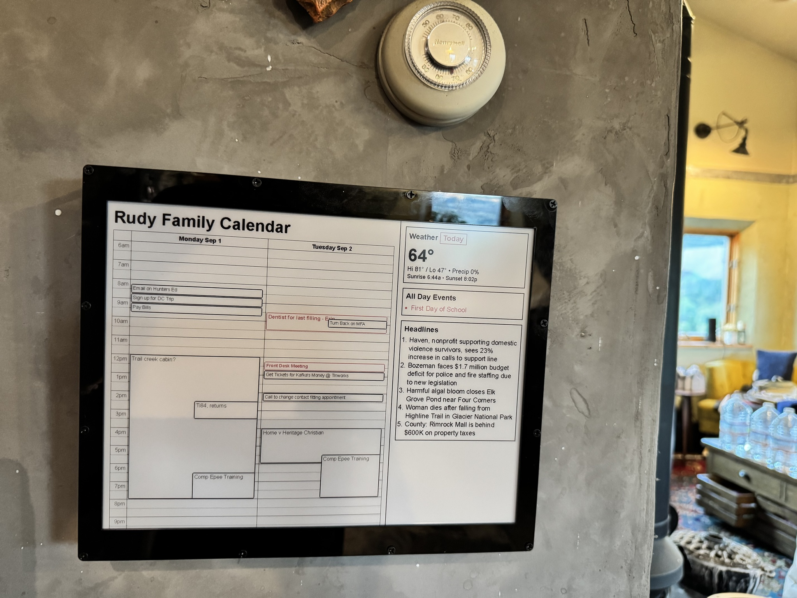

# E-Paper Family 2 Day Calendar



This repository contains the code for creating and uploading the daily board image for the a family 2 Day Calendar built with a Waveshare 12.48" E-Ink Display and a ESP32 display driver and web server.

It contains the following information:

- Today's calendar events
- Tomorrow's calendar events
- Today's weather including alerts
- Today's all day events
- Tomorrow's all day events
- Headlines of local news

## Motivation

My family runs off our shared Google Calendar. With three kid schedules and various other activities, we need to know at a glance in the morning what's going on.

I love the idea of low-power e-ink displays, and have watched various DYI projects showing awesome results.

For us, the most important thing is seeing our calendar events for the upcoming two days. I found a reasonably priced e-ink display that could be mounted in our kitchen and run off a USB power brick.

With a little vibe coding, this was a quick and easy project done over the labor day weekend.

## Hardware and Setup

This project uses a tri-color e-ink display (Black, Red, White) with the following components purchased from Waveshare:

### Components

1. **[12.48" E-Ink Display Module](https://www.waveshare.com/12.48inch-e-paper-module.htm)** - $184.99
   - Resolution: 1304×984 pixels
   - Colors: Red/Black/White three-color
   - Model: 12.48inch e-Paper (B)

2. **[Universal e-Paper Raw Panel Driver Board with ESP32](https://www.waveshare.com/e-paper-esp32-driver-board.htm)** - $14.99
   - ESP32 WiFi/Bluetooth wireless module
   - Driver board for the e-paper display
   - Includes web server capabilities

**Total Cost:** $239.35 (including $39.37 shipping)

### Setup

I used the example code for a web-server running on the ESP32, and with minimal changes got it on my network.

For detailed instructions on setting up the hardware and the ESP32 web server, see [Hardware Setup](docs/hardware_setup.md).

## Daily Board Image

The daily board image is created by a Node.js application that fetches the calendar events, weather, and news headlines, renders them to a web page using puppeteer, and then uploads the image to the ESP32.

It can be personalized with various environment variables, including the calendar URL, weather coordinates, news headlines URL, and more.

## Usage

```bash
# Install dependencies
npm install

# Install firefox for puppeteer
npx puppeteer browsers install firefox

# Create a daily board image
npm run run

# Upload a specific image to the ESP32
npm run upload -- --ip 192.168.1.123 --input ~/picture.jpeg --fit contain --mode 3
```

## Environment Variables

Create a `.env` file with the following configuration:

```env
# Timezone configuration
TZ=America/Denver

# Calendar configuration
ICS_URL=https://calendar.google.com/calendar/ical/your-calendar-id/basic.ics

# Calendar title
CALENDAR_TITLE=Family Calendar

# Important event keywords (comma-separated)
IMPORTANT_TITLE_KEYWORDS=flight,doctor,dentist,surgery,pickup,drop off,deadline,meeting,night,practice,game,concert,tournament,presentation,parent teacher,school
IMPORTANT_LOCATION_KEYWORDS=hospital,clinic,airport,court

# Weather configuration
WEATHER_LAT=44.46063189245875
WEATHER_LON=-110.82812696440988
WEATHER_TIMEOUT_MS=5000

# Headlines configuration
HEADLINES_MAX_ITEMS=5
HEADLINES_TIMEOUT_MS=4000
HEADLINES_URL=https://www.kbzk.com/news.rss
HEADLINES_FALLBACK_URL=https://www.kbzk.com/news/rss

# E-Paper display configuration
EPD_IP=192.168.1.123
EPD_MODEL=12.48inch e-Paper (B)
EPD_MODE=1

# Rendering configuration
RENDER_TRI_COLOR=true
RENDER_DEBUG=false
```

## Docker

I did my best to dockerize the project, but Linux font rendering is not as good as macOS, so I run this on a older MBA with scheduled wake-ups to upload the image to the ESP32.

For more details on font handling and image rasterization, see [Font & Rasterization Details](docs/font-and-rasterization.md).


### Build and Run

```bash
# Build the Docker image
npm run build

# Run with Docker (using .env file)
npm run run-docker

# Run interactively for debugging
docker run -it --env-file .env -v .:/app epaper-calendar bash
```