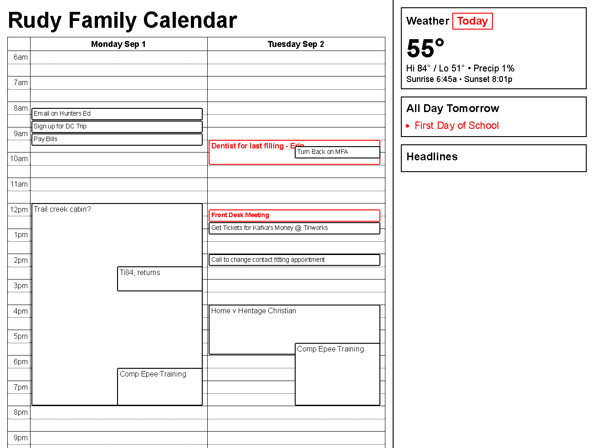
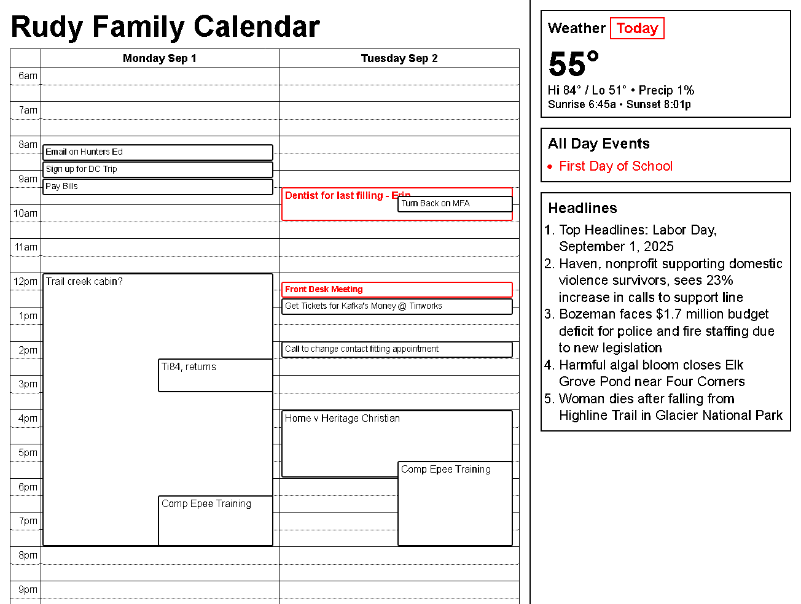

# Font and Rasterization Details

This page explains why the **Docker render** looks not as good as the **macOS render**, even though antialiasing (AA) is disabled in both.

If someone is able to fix this, please let me know!

---

## Side‑by‑side

* **macOS render** (Firefox headless):

  

* **Docker render** (Firefox headless in Debian):

  

Observation: the Docker image shows **stem thickening** (verticals/horizontals appear heavier), producing gray fringes before we snap the image to 1‑bit.

---

## Renderer configuration

We run **Firefox** headless from Puppeteer and explicitly disable text AA:

```ts
const browser = await puppeteer.launch({
  browser: "firefox",
  headless: true,
  // Hard prefs injected into the profile on launch:
  extraPrefsFirefox: {
    // Disables text antialiasing
    "gfx.text.disable-aa": true,
    // Keep geometry deterministic
    "layout.css.devPixelsPerPx": "1.0",
    // Optional: reduce rendering variance in CI
    "gfx.webrender.software": true
  }
});
```

We also nudge CSS to prefer crisp edges:

```css
*{ -webkit-font-smoothing:none; text-rendering:geometricPrecision; }
```

> Note: the CSS hint above is mostly a no‑op in Firefox. The **Firefox** AA setting is controlled by the pref `gfx.text.disable-aa`.

---

## Font selection

The board UI sets Arial as the primary family:

```css
#board{ width:1304px; height:984px; display:flex; font-family: Arial, sans-serif; color:#000; }
```

* **Docker**: we install Microsoft core web fonts so **Arial** resolves through **fontconfig**.
* **macOS**: Arial is present by default; if Arial were missing, the fallback would be the platform sans (e.g., San Francisco), but macOS typically has Arial, so both environments **should** render Arial.

## Why Docker looks heavier (even with AA off)

Linux text rasterization goes through **FreeType** + **fontconfig**. Two behaviors can change stroke weight relative to macOS:

1. **Hinting mode** differences (TrueType interpreter variants) can move stems to the grid differently.
2. **Stem darkening** (especially for CFF/CFF2; some builds also affect the autofitter) can deliberately thicken strokes at small sizes to improve legibility. With AA off, that shows up as heavier, more jagged edges.

I have tried setting these environment variables in the Dockerfile, but it didn't help.

```dockerfile
# FreeType: classic TT interpreter; no stem darkening
ENV FREETYPE_PROPERTIES="truetype:interpreter-version=35 cff:no-stem-darkening=1 autofitter:no-stem-darkening=1"
```
