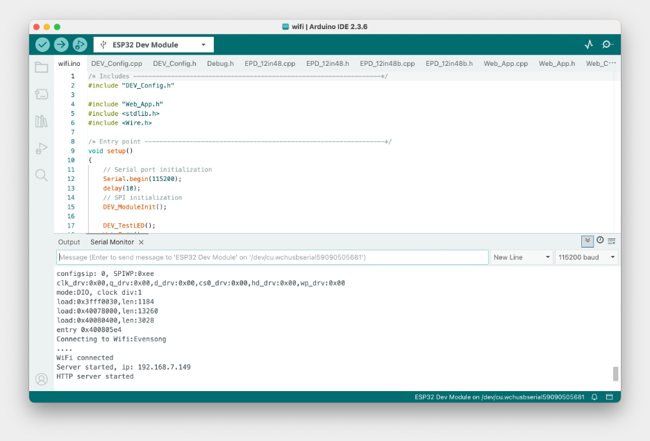
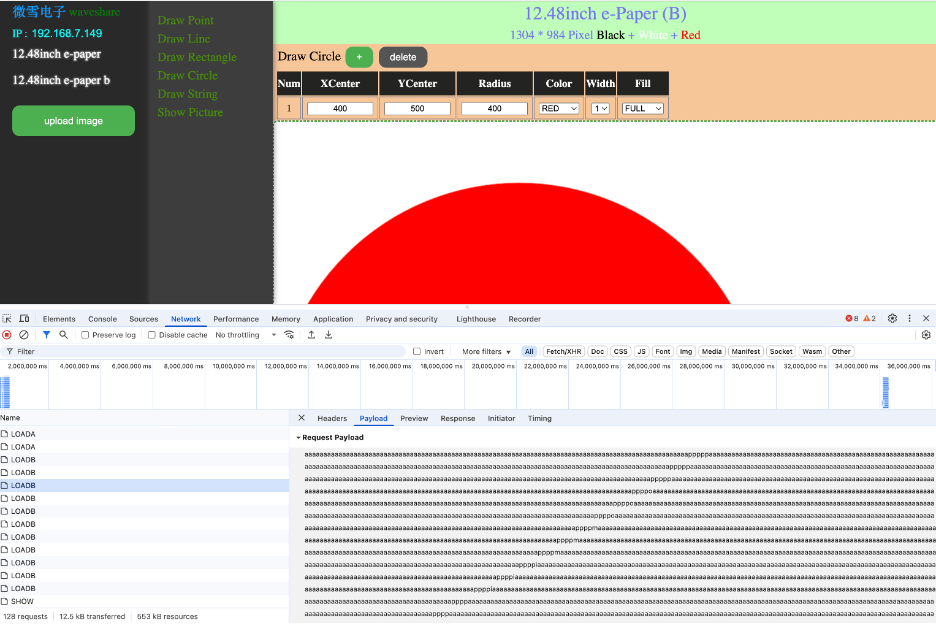
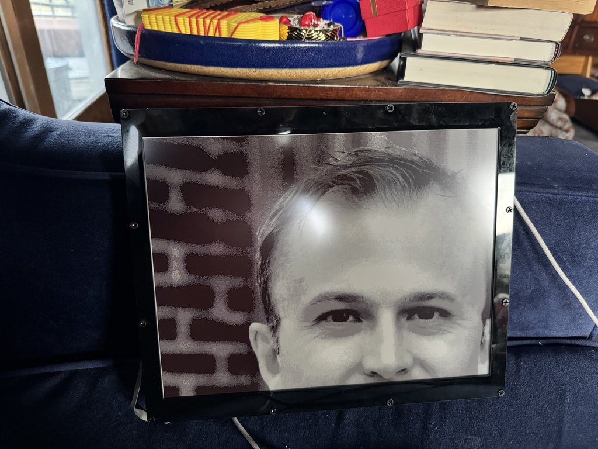

# Hardware Setup — 12.48" E‑Paper + ESP32 (Arduino)

This document walks you from a blank ESP32 to a working on‑device web server that can draw on a **Waveshare 12.48" e‑paper** panel and accept image uploads. It also documents a few tweaks and how to do some basic testing with the built‑in web UI.

> **Tested target**: 12.48" e‑Paper **B** (black+red), ESP32, Arduino core **2.0.17**.

## 1) Prerequisites

* **Arduino IDE** installed
* **ESP32 Arduino core 2.0.17** (installed via Boards Manager)
* **USB‑serial driver** for your ESP32 board (common Mac driver: CH34x)
* **git/gh** to fetch the Waveshare examples

### 1.1 Install ESP32 core (Boards Manager)

1. In Arduino IDE, open **Preferences → Additional Boards Manager URLs** and add:

   ```
   https://raw.githubusercontent.com/espressif/arduino-esp32/gh-pages/package_esp32_index.json
   ```
2. Open **Tools → Board → Boards Manager…**
3. Search **esp32** and install **version 2.0.17** of **esp32 by Espressif Systems**.

> **Note:** On my Mac, the default "version 3" did **not** install successfully in Boards Manager. If you encounter issues, try explicitly selecting **version 2.0.17** of the ESP32 core as described above.


### 1.2 (macOS) Install CH34x USB driver

If your board uses a CH340/CH9102 USB bridge, install:

* [https://github.com/WCHSoftGroup/ch34xser\_macos](https://github.com/WCHSoftGroup/ch34xser_macos)

Reboot if required so the serial port appears, but it showed up right away on my mac.

> **Note:** The CH34x USB driver download page may look sketchy and redirects to a Chinese website, but in my experience, the driver works exactly as expected and was required to talk to my ESP32 board from my Mac.

## 2) Get the Waveshare demo & install as a library

1. Clone the official repo:

   ```bash
   git clone https://github.com/waveshareteam/12.48inch-e-paper.git
   ```
2. Zip the Arduino library folder:

   The code expects a library is already in the Arduino library folder. You can install the library manually with the following steps:

   * Directory to zip: `12.48inch-e-paper/esp32/esp32-epd-12in48`
   * Create `esp32-epd-12in48.zip` from that folder’s contents.
   * In Arduino IDE: **Sketch → Include Library → Add .ZIP Library…** and select your `esp32-epd-12in48.zip`.
4. Try some examples: **File → Examples → esp32-epd-12in48 → …**

> ✅ Hardware test! Run the examples for the **B** panel (two variants). Both work; **Version 1** refreshes faster on this panel. You can also browse to these in the checked out codebase.

## 3) Open the Wi‑Fi web server sketch

1. In Arduino IDE, open: **File → Open... → `esp32/wifi/wifi.ino`**
2. This sketch brings up an **HTTP server on port 80** and serves a simple UI for drawing/uploading an image to the panel.

### 3.1 Configure your Wi‑Fi credentials

Edit the library source that the sketch uses to serve the web app:

* Open **`Web_App.cpp`** in the library (path relative to the library root):

  `esp32/wifi/Web_App.cpp`

* Update the hard‑coded Wi‑Fi credentials in `Web_App.cpp`:

  ```cpp
  const char *WIFI_ssid = "your_wifi_ssid"; 
  const char *WIFI_password = "your_wifi_password";
  ```

> **Tip:** Use a **2.4 GHz** SSID. Many ESP32 boards don’t support 5 GHz.

### 3.2 Optional: faster refresh on 12.48" B

In the B‑panel driver, set **Version = 1** for noticeably faster updates:

* File: `esp32/wifi/EPD_12in48b.cpp`
* Change:

  ```cpp
  UBYTE Version = 2;  // default
  ```

  to

  ```cpp
  UBYTE Version = 1;  // faster refresh, works well on B panel
  ```


## 4) Board/port settings & serial monitor

* **Board:** *ESP32 Dev Module* (or the exact variant matching your hardware)
* **Port:** your board’s serial port
* **Upload Speed:** default is fine
* **Tools → Serial Monitor:** set **115200** baud (matches `wifi.ino` `setup()`)

The Serial Monitor will show boot logs and the **IP address** once the ESP32 connects to Wi‑Fi.


## 5) Build, upload, and capture the IP

1. Click **Upload** in Arduino.
2. Open **Tools → Serial Monitor** at **115200** and reset the board if needed.
3. Wait for a line indicating successful Wi‑Fi connection and the **assigned IP**.

Example output & IDE screenshot:




## 6) Using the built‑in web UI (smoke test)

* Browse to `http://<ESP32_IP>/` (port **80**, **no authentication**).
* In the left menu, select **“12.48inch e‑paper b”**.
* On the right, use the canvas: draw shapes or choose an image.
* Click **Upload image** → the canvas content is sent and rendered on the e‑ink panel.

Web server sending encoded image data to the ESP32:



> In browser **DevTools → Network**, you can watch the client JS stream image data in **ASCII chunks** to endpoints like `/LOADA` and `/LOADB` (black plane and red plane), then `/SHOW` to refresh the panel.

Photo of the panel after a test upload via the web UI:



## 7) Notes on security

* The demo **has no authentication** and exposes upload endpoints.
* Be aware if placing this on a untrusted network!
* Exercise for the reader: add basic auth to the web server.

## 8) Relationship to the Node.js uploader

The standalone **Node.js uploader** in this repo mimics the browser’s JavaScript:

1. Sets panel model via `POST /EPD`
2. Streams the **black** plane with `POST /LOADA`
3. Streams the **red/yellow** plane with `POST /LOADB` (tri‑color only)
4. Triggers refresh via `POST /SHOW`

It produces the exact same on‑panel result as the web UI, but allows automated image generation (calendar, weather, headlines) and deterministic quantization for e‑ink.


**That’s it.** After you have the IP and a successful web‑UI upload, you’re ready to feed images and rendered calendar images from your automated Node.js renderer/uploader.
